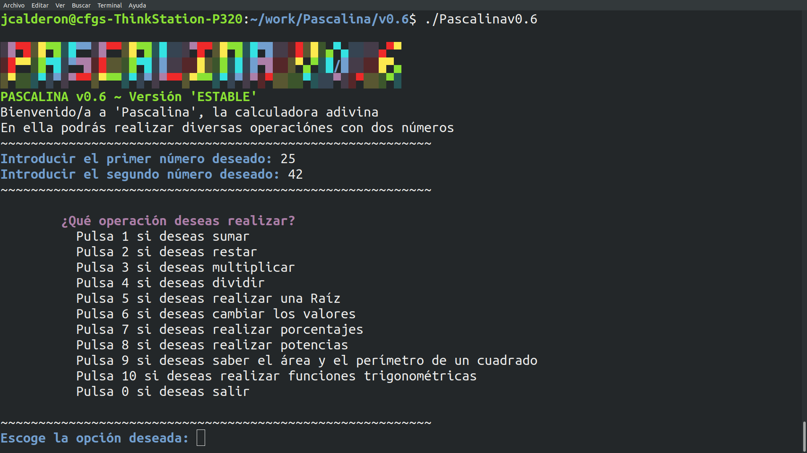
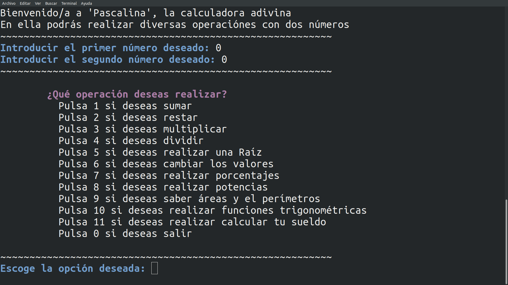

# PASCALINA
Pascalina is a basic calculator in which you can do various operations with two numbers. Currently only available in 'Spanish'

# INSTRUCTIONS
- Open 'Terminal'
- Go to the directory where you keep the files
- Execute: ./Pascalinav0.5.2 (./Pascalinav + the number of version)
- To execute 'Pascalina', will request you two numbers to carry out the operations
- Then you can choose the option of the desired operation
- At the end, you will get the result, and you can perform any other operation

# Enjoy it!
- If you like 'Pascalina', you can give it stars or share it
- If you want to make a request or suggestion for it, please contact me by email; jeluchu@gmail.com

## REQUIREMENT
It is required to have the 'toilet' complement installed
- You can install from the terminal with sudo apt-get install toilet

# VERSIONS

## v1.0 · Blaise Pascal
- Add 'preloader' version
- New name for new version, in this case v1.0 = Blaise Pascal
- New welcome message and farewell
- New feature, you can now use logarithms!
- New grouping of basic operations (addition, subtraction, multiplication and division)
- Created a main menu
- The results of the operations performed will be erased automatically after a short period of time
- Code optimization
- Removed the choice of initial values
- Eliminated the option of the main menu of the change of variables
- Including Pascalina's motto in the main menu

## v0.8
- Fix bugs
- Optimize
- Include the date and time when the program starts
- Included a welcome message

## v0.7.2
- Fix problems with version

## v0.7
- Fix bugs and optimize
- New Options in Principal Menu: Calculate your salary and Areas and perimeters
- New Menu in 'Areas and perimeters'
- In Areas and perimeters, you can choose squares, rectangles, parallelograms and triangles

## v0.6
- Optimize
- New Menu in 'Square Root', you can use 'Cubic Roots'
- NEW FEATURES: Trigonometric functions
- New Menu in Trigonometric functions (sin, cos, tan)

## v0.5.8.2
- Fix bugs
- Create a small 'Preloader'
- Code optimization 'Level 1'

## v0.5.8
- Fix bugs and optimize
- Add NEW FEATURES: Powers; Area and perimeter of a square

## v0.5.7
- Optimize
- Add NEW FEATURES: Percentages

## v0.5.2
- Fix problems and optimize
- Add colors in the Pascalina, Discover them!
- Decimals are included in this version, Enjoy them!

## v0.5
- Fix problems with 'Square Root'
- Add new options
- You can exit pressing option '0'
- You can change the numbers pressing option '6'
- In this version you can made operations: add, subtraction, multiplicate, division and square root

